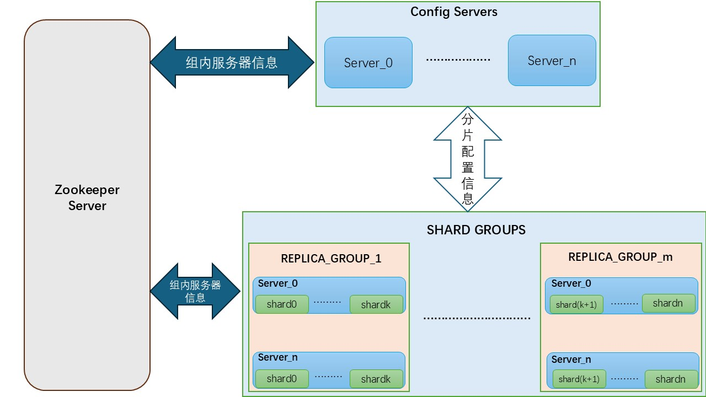
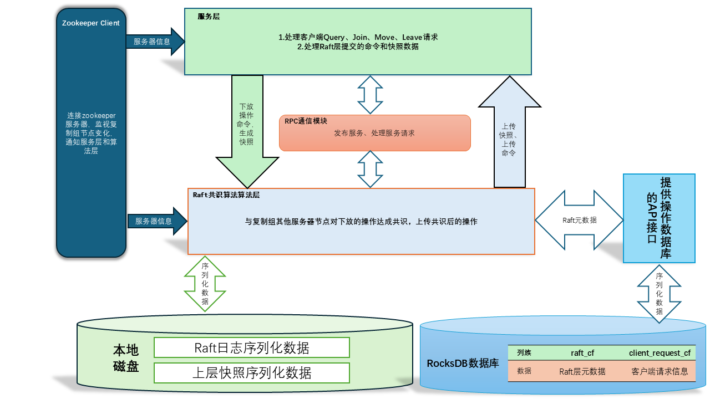
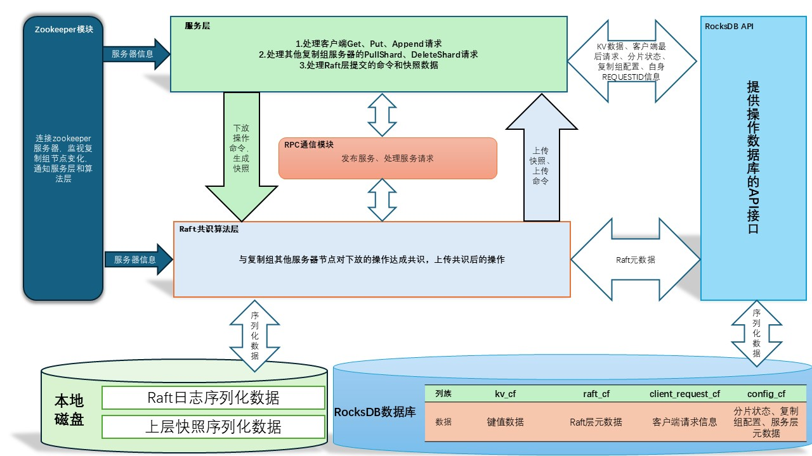

# 分布式键值存储服务器框架
## 1. 简介
基于C++实现的结合Raft算法、RocksDB、Zookeeper、Muduo网络库、Protobuf完成的键值存储服务器，复制组支持Get、Put、Append操作来完成键值存取，配置组支持Join、Move、Leave、Query等操作来完成新复制组的加入、离开、移动与配置查询。配置组和每个复制组中的服务器都通过实现的RPC框架进行通信，每组服务器通过Raft算法来完成对操作的共识，确保不同服务器操作的一致性，服务器组启动后支持添加新的服务器节点，添加新的节点前需要往zookeeper添加新的节点信息，之后通过watcher机制通知组内其他服务器。支持分片机制，启动新的服务器组后，调用配置组的Join请求可以添加新的复制组，配置组会根据当前分片数和复制组数据来平衡分片分配，产生新的配置，每个复制组都会获得最新配置，然后通过通信来交换分片数据。
## 2. 基本模块
1. **Raft 算法实现**  
    实现了 Raft 算法以确保分布式系统中数据的一致性。通过选举 leader 和日志复制，保证了数据的安全性和可靠性，将操作日志复制到集群中的多个服务器，确保数据的持久化和故障恢复能力。配置组和复制组共用该模块。

    **[原始论文链接](https://raft.github.io/raft.pdf)**
2. **KVService 服务层**
    服务层模块包含两类分别为配置组和复制组，在启动服务器之前可以通过参数选择使用类别。
   1. 配置组的服务层
        1. 接收客户端的Join、Query、Move、Leave请求，并将请求形成Raft日志，等待Raft算法层达成共识后获得达成共识的操作，之后同一复制组内的服务器执行同样的命令来达成一致性。
   2. 复制组的服务层 
        1. 接收客户端的Get、Put、Append请求，并将请求形成Raft日志，等待Raft算法层达成共识后获得达成共识的操作，之后同一复制组内的服务器执行同样的命令来达成一致性。
        2. 接收其他分片组的DeleteShard、PullShard请求，处理并返回请求内容。
        3. 实时向配置组发送rpc请求，获取配置组的最新配置，维护分片状态。
3. **RocksDB API**
   Raft算法层和服务层往数据库存储和处理信息的API，RocksDB数据库分为**kv_cf、raft_cf、client_request_cf、config_cf**四个列族，kv_cf主要存储用户的KV数据；raft_cf主要用来存储raft层的元数据例如当前任期、快照中执行的最后一个日志的index和term、投票对象等；client_request_cf用来存储每个用户最后执行的命令的信息，该信息一般是与KV操作同步更新；config_cf主要用来存储分片状态相关信息、最后提交命令的index、从配置组获取的所有配置、最新配置。

4. **ZooKeeper 客户端API**  
   使用 ZooKeeper 记录现有配置组和复制组服务器的信息（ip:port），
   1. `/kvserver/shard_config_group/servers` 路径下存储服务器列表`[server0,server1,...]`。
   2. 在 `/kvserver/replica_group`下存储`[gid1,gid2....]`,每个复制组`/kvserver/replica_group/gidn`下保存`[server0,server1..]`。  

    对于每个servern下都保存着`ip:port`形式的服务器信息， 在服务器启动后，在上述路径上设置监听器，实时监控服务器列表的变化。
5. **RPC 框架**  
   使用 Protocol Buffers 定义消息类型和rpc服务，实现高效的数据序列化和反序列化,并以muduo网络库作为网络数据收发的基本框架。
6. **线程安全队列**  
    实现了一个线程安全的队列，模拟 Go 语言的 channel 特性。支持有缓冲和无缓冲两种模式，确保数据在多线程环境下的安全访问。通过锁和条件变量实现高效的线程同步，减少线程间的竞争和等待时间。
7. **定时器**  
    实现了一个定时器类，支持定时触发回调函数，可以选择秒和毫秒类型，用于实现心跳检测、leader选举等功能。
8. **异步日志打印**  
    实现异步日志打印功能，减少日志操作对主线程的影响，提高系统性能，支持日志的缓冲和批量写入，提高日志记录的效率。
## 3. 框架
### 整体框架

服务器的地址都存储在Zookeeper的服务器内，复制组通过rpc请求获得配置组的最新配置，之后复制组会根据配置来处理分片。
### 配置组框架

配置组没有形成快照的功能，只保存日志，每次重启只需要重放日志就可以恢复到关机时的状态，并且只用到了两个列族。
### 复制组框架

## 4. 使用注意事项
1. 需要下载rocvksdb的C++库、zookeeper的c客户端库（包含api接口）和发行版（zkServer.sh 和 zkCli.sh）、protobuf相关库、muduo网络库到系统的include或者lib目录下。
2. 需要执行根目录下的CMakeList.txt文件，就会编译出所有的test内的文件，你可以在/bin目录下的/bin/kvserver_test下找到复制组的可执行文件，只需要根据提示输入你自己的地址信息即可，在/bin/shard_ctler_server_test可以找到配置组的可执行文件，使用案例放在了/test目录下
3. 启动服务器前最好先在你的zookeeper服务器内按照上述路径来配置好你的服务器信息。
4. 该项目主要用来自身学习使用，资源有限没有经过严格的测试，可能存在一些bug。