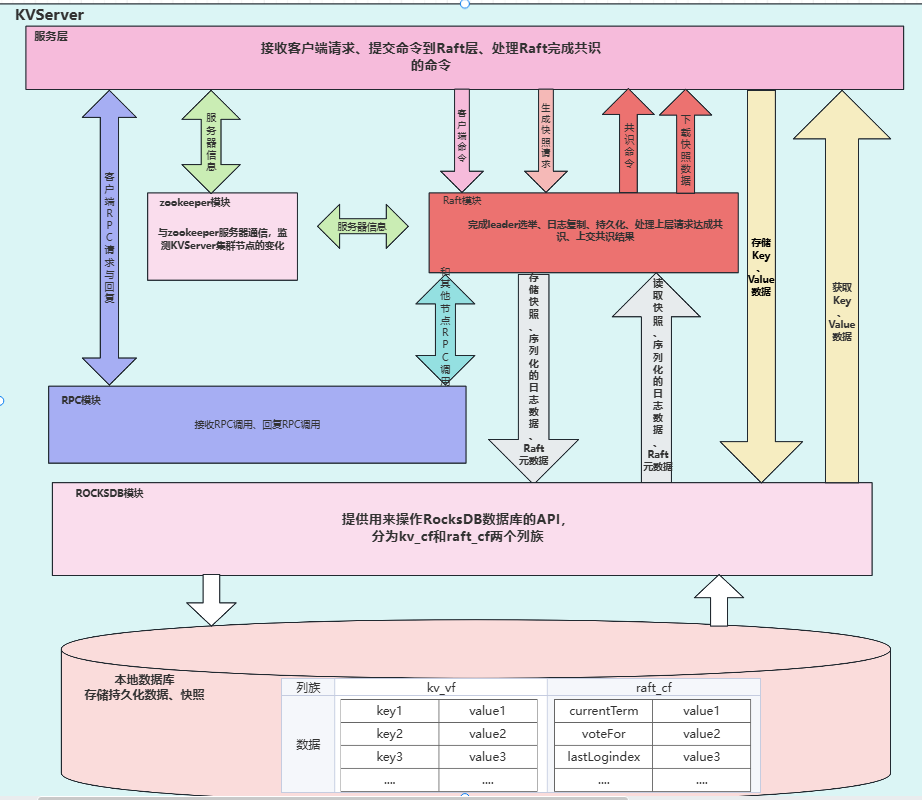

# KVServer
## 简介
在用go完成mit6.5840的基础上，用C++实现了一个简易的KVServer用来加深理解。
## 核心模块
1. **Raft 算法实现**  
    实现了 Raft 算法以确保分布式系统中数据的一致性。通过选举 leader 和日志复制，保证了数据的安全性和可靠性，将操作日志复制到集群中的多个服务器，确保数据的持久化和故障恢复能力。
2. **RPC 框架**  
   使用 Protocol Buffers 定义消息类型和rpc服务，实现高效的数据序列化和反序列化,并以muduo网络库作为网络数据收发的基本框架。
3. **数据持久化**  
    利用 Boost 库的序列化功能，实现数据的持久化存储。支持将 Raft 的 term、voteFor、日志和快照等关键信息序列化到磁盘，实现数据的读写操作，支持数据的持久化存储和恢复。
4. **ZooKeeper 集成**  
   使用 ZooKeeper 记录现有服务器的信息（如 IP 和端口），在 `/kvserver/servers` 路径下存储服务器列表。在 `/kvserver/servers` 路径上设置监听器，实时监控服务器列表的变化。
   当有新的服务器加入或离开时，客户端和服务器集群会收到通知，并更新服务器列表。实现 ZooKeeper 客户端，用于连接和操作 ZooKeeper 服务器。支持服务器列表的动态更新和监听器的设置。
   处理 ZooKeeper 服务器发送的事件通知，确保系统在服务器列表变化时能够及时做出响应。
6. **线程安全队列**  
    实现了一个线程安全的队列，模拟 Go 语言的 channel 特性。支持有缓冲和无缓冲两种模式，确保数据在多线程环境下的安全访问。通过锁和条件变量实现高效的线程同步，减少线程间的竞争和等待时间。
7. **定时器**  
    实现了一个定时器类，支持定时触发回调函数。可用于实现心跳检测、leader选举等功能。
8. **异步日志打印**  
    实现异步日志打印功能，减少日志操作对主线程的影响，提高系统性能，支持日志的缓冲和批量写入，提高日志记录的效率。
## 框架
